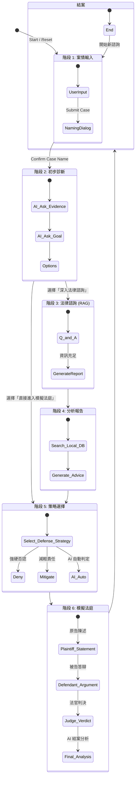

# ⚖️ Virtual Moot Court (虛擬法庭模擬器)
(2026 Theory of Computation Final Project)

這是一個基於 Python 與 Streamlit 的 AI 法律諮詢與模擬法庭系統。透過本地運行的 LLM (Llama3) 與本地法規資料庫，提供使用者從案情分析、法律諮詢到模擬法庭攻防的一站式體驗。

---

## 📋 功能介紹

1. **案情診斷 (Diagnosis)**：引導使用者輸入案情，並透過 AI 初步釐清訴求。
2. **法律諮詢 (Consultation)**：扮演律師角色，對案情進行追問與釐清。
3. **法規檢索與報告 (RAG Analysis)**：自動分析案情，從本地 `law_data` 資料庫檢索相關法條（如刑法、民法等），並生成正式的法律分析報告。
4. **策略選擇 (Strategy)**：使用者可選擇被告的辯護策略（強硬否認、減輕責任或 AI 自動判定）。
5. **模擬法庭 (Virtual Court)**：

- **原告律師**：進行開場陳述與指控。
- **被告律師**：根據選定策略進行答辯。
- **法官判決**：綜合雙方論點與法條做出判決。
- **結案分析**：AI 顧問評估勝訴率並提供後續建議。

---

## 🛠️ 使用技術

- **Frontend**: Streamlit
- **Backend Logic**: Python
- **LLM Engine**: Ollama (Llama3 model)
- **Data Retrieval**: Regex-based local file search (RAG)

---

## 🚀 Quick Start (Installation & Execution)

請依照您的作業系統，依序執行以下步驟。

### 前置需求 (Prerequisites)

本專案依賴本地 LLM，請務必先安裝 **Ollama**。

1. 前往 [Ollama 官網](https://ollama.com/) 下載並安裝 Ollama。
2. 安裝完成後，打開終端機，下載 Llama3 模型：

```bash
ollama pull llama3

```

3. 確認 Ollama 服務正在背景執行。

### 步驟 1：Clone 專案

```bash
git clone https://github.com/david911226/Virtual_Moot_Court.git
cd Virtual_Moot_Court

```

### 步驟 2：建立虛擬環境 (Virtual Environment)

強烈建議使用虛擬環境以避免套件衝突。

**macOS / Linux:**

```bash
# 建立虛擬環境
python3 -m venv venv

# 啟動虛擬環境
source venv/bin/activate

```

**Windows (PowerShell):**

```powershell
# 建立虛擬環境
python -m venv venv

# 啟動虛擬環境
.\venv\Scripts\Activate.ps1

```

(若 Windows 出現權限錯誤，請先執行 `Set-ExecutionPolicy RemoteSigned -Scope CurrentUser`)

### 步驟 3：安裝依賴套件

**macOS / Linux:**

```bash
pip3 install -r requirements.txt

```

**Windows (PowerShell):**

```powershell
pip install -r requirements.txt

```

### 步驟 4：執行程式

```bash
streamlit run app.py

```

執行後，系統會自動開啟瀏覽器，預設網址為 `http://localhost:8501`。

---

## 📂 專案結構說明

```text
Virtual_Moot_Court/
├── app.py                # 主程式，負責頁面流程與狀態管理
├── backend.py            # 後端邏輯，包含 LLM 呼叫、資料庫檢索、檔案存取
├── ui.py                 # 前端樣式，包含 CSS 與 UI 輔助函式
├── law_data/             # 本地法規資料庫 (.txt 檔案)
│   ├── 民法.txt
│   ├── 中華民國刑法.txt
│   └── ...
├── .streamlit/
│   └── config.toml       # Streamlit 全域主題設定
├── chat_history.json     # 對話紀錄
└── requirements.txt


```

---

## 📊 系統狀態機圖 (State Machine Diagram)

本系統採用狀態機 (State Machine) 管理使用者流程，確保法律程序的邏輯順序。



---

### ⚠️ 注意事項

1. **Ollama 服務**：執行程式前，請務必確保本地端的 Ollama 應用程式已開啟，否則會出現 `Connection Error`。
2. **法規資料**：程式依賴 `law_data/` 資料夾內的 `.txt` 檔案進行 RAG 檢索，使用者可依需求自行增減法條檔案。
